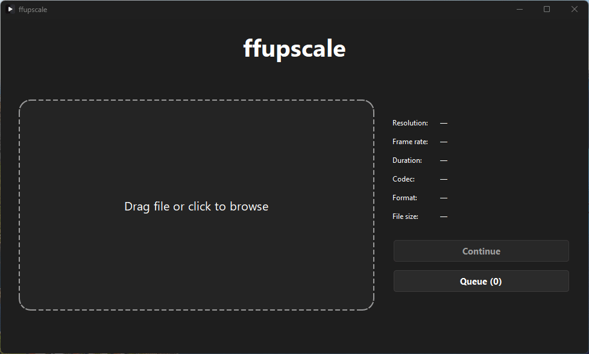
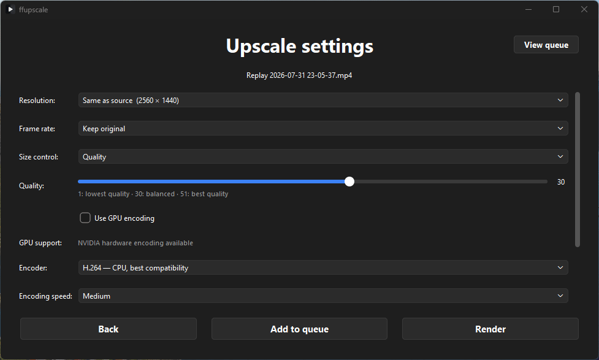

<p align="center">
  
</p>

<h1 align="center">ffupscale</h1>

<p align="center">
  <strong>A simple Windows video upscaler powered by FFmpeg.</strong>
</p>

<p align="center">
  Upscale, compress and queue videos without working with command-line arguments.
</p>

<p align="center">
  <a href="https://github.com/kianyng/ffupscale/releases/latest">
    <strong>Download ffupscale</strong>
  </a>
  ·
  <a href="https://github.com/kianyng/ffupscale/issues">Report a bug</a>
  ·
  <a href="BUILDING.md">Build from source</a>
</p>

<p align="center">
  
  
  
</p>

<p align="center">
  
  &nbsp;
  
</p>

## About

FFmpeg is an extremely capable video-processing tool, but it normally requires
a command prompt, terminal or batch file.

ffupscale provides a native Windows interface for its most useful upscaling and
encoding features. Import a video, choose your output settings and render it
without writing an FFmpeg command yourself.

FFmpeg and FFprobe are included with the packaged application, so no separate
installation or system `PATH` configuration is required.

## Features

- Drag-and-drop video importing
- Video thumbnail and property display
- Same-as-source, preset and custom resolutions
- Original, preset and custom frame rates
- H.264 and H.265 encoding
- Automatic detection of usable CPU and GPU encoders
- NVIDIA NVENC, AMD AMF and Intel Quick Sync support
- Adjustable encoding quality and speed
- Target file size compression
- Custom output folder and filename
- Sequential render queue
- Render-now and render-next queue controls
- Live rendering progress
- Render cancellation and retrying
- Bundled FFmpeg and FFprobe

## Download

Download the latest Windows release from the
[GitHub Releases page](https://github.com/kianyng/ffupscale/releases/latest).

### Installation

1. Download the Windows ZIP file.
2. Extract the complete ZIP.
3. Open the extracted `ffupscale` folder.
4. Run `ffupscale.exe`.

> [!IMPORTANT]
> Do not run `ffupscale.exe` directly from inside the ZIP or move it away from
> the adjacent `_internal` folder.

Windows may display a SmartScreen warning because ffupscale is not currently
code-signed. If you downloaded it from this repository, select **More info**
and then **Run anyway**.

## How to use

1. Drag a video into the drop area or click it to browse.
2. Review the detected thumbnail and video properties.
3. Select **Continue**.
4. Choose your resolution, frame rate, encoder and output settings.
5. Select **Render** to begin immediately, or add the video to the queue.
6. Follow the live progress display until the render finishes.

Completed queue items can open their output folder directly from the
application.

## Encoding

### CPU and GPU encoding

ffupscale always provides software H.264 and H.265 encoding.

When the application starts, it also checks whether the computer has a usable
hardware encoder. Supported FFmpeg encoders include:

| Hardware | H.264 | H.265 |
| --- | --- | --- |
| NVIDIA | NVENC | NVENC |
| AMD | AMF | AMF |
| Intel | Quick Sync | Quick Sync |

A compatible GPU, current graphics driver and supported FFmpeg build are
required. If hardware encoding is unavailable, CPU encoding remains available.

### Quality mode

Quality mode prioritises visual quality rather than a specific output size.
Higher values on the quality slider produce better quality and generally larger
files.

### Target file size mode

Target file size mode calculates the approximate video bitrate required to
reach the requested output size.

The final size may differ slightly because encoder behaviour and MP4 container
overhead cannot be predicted perfectly. ffupscale displays an estimated or
recommended minimum when enough information is available.

## Requirements

### Packaged application

- 64-bit Windows 10 or Windows 11

Python, PyQt6, FFmpeg and FFprobe are included in the packaged release.

### Running from source

- Python 3.9 or newer
- The packages listed in [requirements.txt](requirements.txt)
- FFmpeg and FFprobe in `vendor/ffmpeg/bin`, or available through the system
  `PATH`

From the repository root:

```powershell
py -m pip install -r requirements.txt
py src\main.py
```

See [BUILDING.md](BUILDING.md) for the complete Windows packaging process and
release checklist.

## Current limitations

- Windows is the only officially supported operating system.
- Rendered videos currently use the MP4 container.
- Hardware encoding depends on the installed GPU and graphics driver.
- Target file sizes are estimates and may not be exact.
- Extremely low target sizes may not be achievable at high resolutions or
  frame rates.

## Planned features

- Integrated video trimmer
- Additional output formats
- Further encoder and hardware support

Suggestions and bug reports are welcome through
[GitHub Issues](https://github.com/kianyng/ffupscale/issues).

## Third-party software

Packaged releases include the unmodified FFmpeg 8.1.2 full Windows build,
licensed under GPLv3.

See:

- [Third-Party Notices](THIRD_PARTY_NOTICES.md)
- [FFmpeg build information](licenses/FFmpeg-BUILD-INFO.txt)
- [Complete GPLv3 text](licenses/GPL-3.0.txt)

## Licence

ffupscale is licensed under the
[GNU General Public License v3.0](LICENSE.txt).

You may use, modify and redistribute ffupscale, provided that redistributed
versions remain open source under GPLv3 and retain the applicable copyright and
licence notices.
